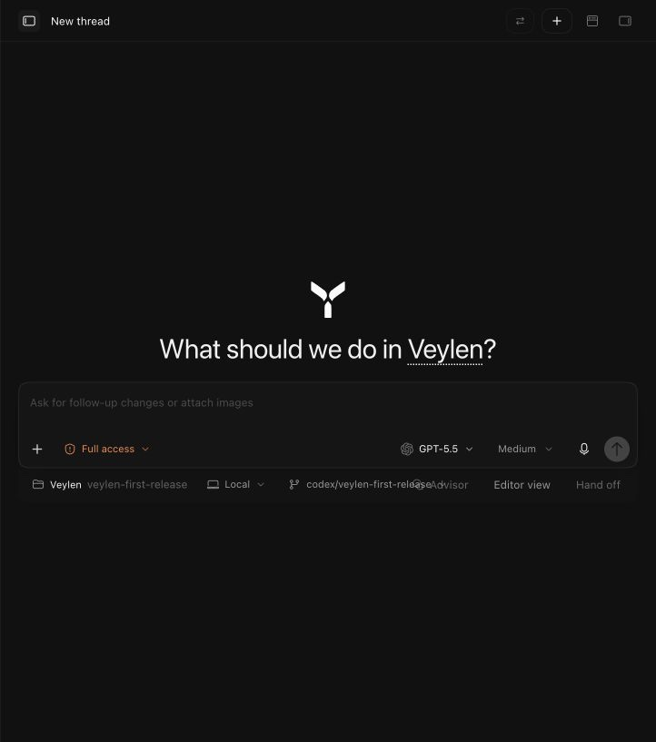

# Veylen

Veylen is now an MCP-native agent harness in two directions: supported agents running inside Veylen
automatically receive tools to coordinate Veylen tasks and automations, while Codex, Claude, and
other local MCP clients can connect through a scoped integration to launch and follow Veylen work.

To let a local MCP-capable app create and follow scoped Veylen tasks, see
[External MCP integrations](docs/external-mcp.md).

Veylen is a local-first desktop app for coding with the AI agents and subscriptions you already use.

It brings chats, terminals, browser previews, diffs, branches, provider sessions, and handoffs into one focused workspace so you can run agent work without juggling a dozen windows.



## What it does

- Use the AI accounts you already pay for: Claude Code, Codex, Antigravity, OpenCode, Cursor, Grok, Kilo Code, and Pi.
- Run parallel work across projects, threads, and isolated Git worktrees without branches stepping on each other.
- Keep split chats, terminals, browser previews, and agent output visible in the same window.
- Hand off a thread to another provider when you want a second model to pick up with the same context.
- Review diffs, create branches, commit, push, and open PRs from the app.
- Keep your workspace local. Veylen stores chats, projects, and history on your machine and talks directly to the providers you choose.

## How to use

> [!WARNING]
> You need to have [Codex CLI](https://github.com/openai/codex) installed and authorized for Codex sessions to work.

Install the desktop app from the [Veylen Releases page](https://github.com/ReinaMacCredy/veylen/releases).

You can also run Veylen locally while the project is still early:

```sh
bun install
bun run dev
```

## Privacy

Veylen runs as the workspace layer on your machine. There is no Veylen cloud holding your repositories, chats, or project history.

The provider you choose still receives the prompts, file snippets, diffs, terminal output, or tool results needed for a session, but that traffic goes to the provider you picked rather than through a separate Veylen-hosted workspace.

## Some notes

Veylen is still very early. Expect bugs, rough edges, and fast-moving internals.

Focused issues and PRs are welcome, especially bug fixes, reliability fixes, and small maintenance improvements.

## Contributing

Read [CONTRIBUTING.md](./CONTRIBUTING.md) before opening an issue or PR.

Need support? [Open a GitHub issue](https://github.com/ReinaMacCredy/veylen/issues).

## Origins

Veylen is an independent project maintained by Reina MacCredy. It began as a fork of [Synara](https://github.com/Emanuele-web04/Synara), which itself began as a clone of [T3Code](https://github.com/pingdotgg/t3code). Veylen retains the upstream MIT notices and Git history while developing its own branding, packaging, release system, provider orchestration, desktop app behavior, and product direction.

The current application icon is a temporary inherited placeholder. The final Veylen icon will be designed separately by the project owner.
