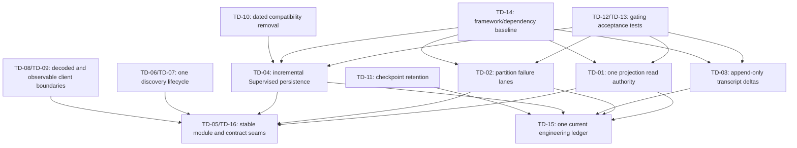

# Veylen repository-wide technical-debt audit

**Audit date:** 2026-08-12

**Audited revision:** `96673ccd2ec4769f4719f8f8fc40d11e0f4a1d8d`

**Scope:** current Veylen monorepo (`apps/server`, `apps/web`, `apps/desktop`, `packages/contracts`, `packages/shared`, build/release tooling, tests, migrations, and durable documentation)

**Mode:** audit only; no production remediation

## Audit method and terminology

This report is based on current source, configuration, tests, migrations, repository history, and
durable design/audit records. Historical pre-rebrand and Veylen audits were treated as leads and reconciled
against the audited revision rather than copied forward.

Confidence means:

- **Confirmed:** the debt mechanism is directly present in current source or configuration.
- **Strong:** multiple current signals support the finding, but the impact still needs a runtime
  measurement or failure reproduction.
- **Suspected:** a plausible issue with an explicit validation step; it is not a remediation
  commitment yet.

Severity means:

- **P0:** release or common-path blocker with demonstrated data loss, security compromise, or
  catastrophic failure.
- **P1:** high-leverage correctness, durability, scaling, lifecycle, or supply-chain risk.
- **P2:** material architecture, maintainability, observability, or test-coverage debt.
- **P3:** bounded improvement that should wait for evidence or an owning workstream.

Effort is **S** (days), **M** (roughly one focused milestone), **L** (multi-module milestone), or
**XL** (staged program with migrations or broad compatibility work).

No P0 issue was found. That does not mean the repository is risk-free; the principal risks are
systemic P1 debts whose failure probability rises with longer transcripts, more Supervised state,
provider diversity, and framework churn.

## 1. Executive summary

Veylen has unusually strong foundations for an early product: typed Effect RPC, bounded transport
admission, durable event journals, migration lineage guards, provider process ownership, explicit
recovery paths, security-focused outbound HTTP, and a large regression corpus. Previous audits
closed many genuinely dangerous authorities. The current repository is not a fragile prototype.

The remaining debt is concentrated in five system shapes:

1. The orchestration command engine still exposes a compatibility in-memory read model that current
   production reactors consume alongside the projection query authority (`TD-01`).
2. Provider runtime ingestion has one global durable cursor, so one poison row blocks every thread
   and provider for at least the poison-gate window (`TD-02`).
3. Two persistence paths scale with accumulated state rather than the incoming change: transcript
   text is rewritten per delta (`TD-03`), and Supervised reconciliation reads and can rewrite broad
   snapshots per event (`TD-04`).
4. Core behavior remains concentrated in very large mixed-responsibility owners across web,
   provider, orchestration, RPC, and contracts (`TD-05`, `TD-16`).
5. The dependency and verification envelope is weaker than the runtime design: the entire Effect
   stack is pinned to a preview commit plus a local patch (`TD-14`), while real provider and Electron
   E2E paths do not gate CI (`TD-12`).

The recommended order is not “split large files first.” First establish gating cross-layer tests,
then remove dual state ownership and global failure coupling, then make the hot persistence paths
incremental. Only after those authority moves should the large modules and contracts be split at the
new stable seams.

## 2. Repository health assessment

| Dimension                     | Assessment                         | Evidence-based interpretation                                                                                                                                                                               |
| ----------------------------- | ---------------------------------- | ----------------------------------------------------------------------------------------------------------------------------------------------------------------------------------------------------------- |
| Architecture                  | **Amber**                          | Package roles are clear, but production still crosses a declared compatibility read-model boundary and several central owners contain many unrelated lifecycles.                                            |
| Runtime correctness           | **Amber**                          | Lifecycle, admission, recovery, and idempotency work is strong; global journal blocking and Claude agent discovery still expose common-path correctness/availability problems.                              |
| Persistence                   | **Amber-red under growth**         | SQLite lifecycle and migration discipline are strong. Per-delta row rewrites, broad Supervised snapshots, and retained Git checkpoint refs scale with accumulated history.                                  |
| API and contracts             | **Amber**                          | Effect RPC schemas protect the main socket path. Static/runtime model catalogs coexist, auth HTTP responses bypass schema decoding, and the orchestration contract aggregate is oversized.                  |
| Tests                         | **Amber**                          | The unit/browser corpus is broad, but critical live-provider and Electron E2E scenarios do not gate CI, and 11 geometry cases are explicitly non-blocking.                                                  |
| Frontend                      | **Amber**                          | Transcript behavior has careful performance guardrails, but `ChatView` and `Sidebar` remain coordination hubs for many unrelated domains.                                                                   |
| Performance                   | **Amber-red under long-lived use** | Common paths are bounded, but two confirmed algorithms are proportional to accumulated content/state rather than the change.                                                                                |
| Reliability and observability | **Amber**                          | Server-side failure handling is generally explicit. Some client subscriber and discovery failures are intentionally swallowed, making faults indistinguishable from empty state.                            |
| Security and trust boundaries | **Green-amber**                    | Desktop, child process, outbound HTTP, and WebSocket boundaries are materially hardened. Auth JSON still relies on TypeScript casts, and the preview framework source raises supply-chain/upgrade exposure. |
| Build and dependencies        | **Amber-red**                      | Locking is reproducible, but core Effect packages come from `pkg.pr.new` at an unreleased commit and require a local runtime patch.                                                                         |
| Maintainability               | **Amber-red**                      | Prior pruning removed duplicate authorities, yet change blast radius remains high in the largest client/server owners and compatibility fan-out.                                                            |
| Documentation                 | **Red**                            | Several durable documents describe already-shipped work as future or unchecked, and workflow/audit status records contradict current source.                                                                |

## 3. Inventory by category

### Architecture and boundaries

- `TD-01`: production consumers use the command engine's compatibility read model as well as
  projection repositories.
- `TD-05`: mixed-responsibility web/server owners make independent change and review difficult.
- `TD-16`: the main orchestration contract file combines protocol registry, entity model, commands,
  events, snapshots, and compatibility in one aggregate.

### Runtime correctness and lifecycle

- `TD-02`: one poison runtime event blocks the single global journal cursor.
- `TD-07`: Claude agent discovery returns an empty `pending` result before asynchronous work settles,
  swallows failure, and lets the client cache the empty result.

### Persistence and data model

- `TD-03`: streaming text remains quadratic in accumulated message length.
- `TD-04`: Supervised projection/reconciliation is snapshot-shaped and can delete/reinsert broad
  governance state for a local change.
- `TD-11`: durable per-message/per-turn Git refs have no active-thread retention bound.

### API and contracts

- `TD-06`: static model metadata remains a second authority beside runtime provider discovery.
- `TD-08`: auth HTTP responses are trusted through generic casts instead of contract decoding.
- `TD-16`: contract ownership is concentrated in one 2,712-line aggregate.

### Tests and verification

- `TD-12`: existing live-provider and real Electron tests do not gate the main CI workflow.
- `TD-13`: 11 pixel/font/layout cases are quarantined in a continue-on-error job.

### Frontend and UI

- `TD-05`: `ChatView` and `Sidebar` remain broad application coordinators.
- `TD-09`: subscriber exceptions are isolated but completely unobservable.
- `TD-13`: geometry correctness differs between local/macOS and blocking Ubuntu verification.

### Performance and scalability

- `TD-03`, `TD-04`, and `TD-11` are the confirmed growth-sensitive paths.
- `S-01`, `S-02`, and `S-03` are measurement candidates, not established remediation work.

### Reliability and observability

- `TD-01`, `TD-02`, `TD-07`, `TD-09`, and `TD-12` are the main gaps.
- The repository already has typed overload, staged shutdown, poison recovery, and degraded-state
  mechanisms. The debt is scope and visibility, not absence of reliability design.

### Security and trust boundaries

- `TD-08` is the remaining directly evidenced client trust-boundary gap.
- `TD-14` is a supply-chain and emergency-upgrade risk, mitigated but not eliminated by exact hashes
  and the lockfile.
- No current evidence justified reopening the completed child-secret, outbound-HTTP, desktop native
  control, or WebSocket compatibility programs.

### Build, tooling, and dependencies

- `TD-14`: preview Effect stack plus a source/distribution patch.
- `TD-12`: current CI builds the desktop pipeline but does not execute the repository's real
  Electron Playwright suite.

### Code quality and maintainability

- `TD-05`: mixed ownership in central modules.
- `TD-10`: necessary but broad legacy/canonical Supervised vocabulary.
- `TD-16`: orchestration contract aggregate makes unrelated protocol evolution conflict-prone.

### Documentation and specification

- `TD-15`: `TODO.md`, the server migration inventory, workflow evolution map, and historical audit
  checkboxes conflict with current source and one another.

## 4. Prioritized findings

| ID    | Finding                                                                | Category                            | Confidence | Severity | Effort | Defect likelihood         | Blast radius                                                   |
| ----- | ---------------------------------------------------------------------- | ----------------------------------- | ---------- | -------- | ------ | ------------------------- | -------------------------------------------------------------- |
| TD-01 | Compatibility command read model remains a production authority        | Architecture / reliability          | Confirmed  | P1       | L      | Medium-high               | All orchestration and Supervised consumers that mix read paths |
| TD-02 | Global runtime-journal cursor couples every provider to one poison row | Runtime / reliability               | Confirmed  | P1       | L      | Medium                    | All threads and providers until dead-letter recovery           |
| TD-03 | Streaming transcript persistence is quadratic in message length        | Persistence / performance           | Confirmed  | P1       | L      | High for long responses   | SQLite writer latency, projection lag, transcript freshness    |
| TD-04 | Supervised projection and reconciliation are snapshot-shaped           | Persistence / scalability           | Confirmed  | P1       | XL     | Medium, rising with state | Supervised commands, daemon reconciliation, SQLite writer      |
| TD-12 | Critical provider and Electron E2E paths do not gate CI                | Tests / reliability                 | Confirmed  | P1       | L      | Medium-high               | Releases and cross-layer lifecycle changes                     |
| TD-14 | Core Effect stack is an unreleased snapshot plus local patch           | Build / dependencies / supply chain | Confirmed  | P1       | XL     | Medium                    | Nearly every package and process/runtime boundary              |
| TD-05 | Central web and server owners contain unrelated lifecycles             | Architecture / maintainability      | Confirmed  | P2       | XL     | Medium                    | High review and regression radius                              |
| TD-06 | Static and runtime model catalogs remain dual authorities              | API / contracts                     | Confirmed  | P2       | L      | Medium                    | Provider/model rollout and persisted compatibility             |
| TD-07 | Claude agent discovery returns and caches false-empty pending state    | Runtime / observability             | Confirmed  | P2       | M      | High on first discovery   | Claude agent/subagent chooser                                  |
| TD-08 | Auth HTTP response types are asserted, not decoded                     | Security / contracts                | Confirmed  | P2       | M      | Low-medium                | Pairing, sessions, bootstrap, logout                           |
| TD-09 | Client subscriber failures are silently discarded                      | Observability / frontend            | Confirmed  | P2       | S      | Medium                    | Any WebSocket push subscriber                                  |
| TD-10 | Legacy and canonical Supervised vocabularies fan out until 2027        | Transitional compatibility          | Confirmed  | P2       | L      | Medium during changes     | Contracts, projector, web reducer, imports, replay             |
| TD-11 | Active-thread checkpoint refs have no retention bound                  | Persistence / repository hygiene    | Confirmed  | P2       | M      | High over time            | User Git repositories and checkpoint operations                |
| TD-13 | Browser geometry regression coverage is non-blocking                   | Tests / frontend                    | Confirmed  | P2       | M      | Medium                    | Responsive transcript and composer layout                      |
| TD-15 | Durable engineering documents contradict current source                | Documentation / governance          | Confirmed  | P2       | M      | High for planning         | Audits, workflow decisions, onboarding, migration work         |
| TD-16 | Orchestration contracts are one broad aggregate                        | API / maintainability               | Confirmed  | P2       | L      | Medium                    | Server/web protocol changes and merge conflicts                |
| S-01  | Runtime-event append could benefit from one SQL upsert                 | Performance                         | Suspected  | P3       | M      | Unknown                   | Provider event ingestion                                       |
| S-02  | Very long transcript virtualization thresholds may need tuning         | Frontend performance                | Suspected  | P3       | L      | Unknown                   | Long-history threads only                                      |
| S-03  | Periodic thread-runtime reconciliation may need an index at scale      | Persistence performance             | Suspected  | P3       | M      | Unknown                   | Background SQLite load                                         |
| S-04  | Long-running provider/ACP process memory needs packaged soak proof     | Reliability / performance           | Suspected  | P3       | M      | Unknown                   | Provider processes and desktop memory                          |

## 5. Detailed evidence and remediation

### TD-01 — Compatibility command read model remains a production authority

- **Category / confidence / severity / effort:** Architecture and reliability / Confirmed / P1 / L.
- **Evidence:** `apps/server/src/orchestration/Services/OrchestrationEngine.ts:99-104` says
  `getReadModel` is for tests and compatibility and runtime snapshots should prefer
  `ProjectionSnapshotQuery`. Its implementation repeats that production should query projections
  (`apps/server/src/orchestration/Layers/OrchestrationEngine.ts:2834-2837`). Current production uses
  remain in `apps/server/src/wsRpc.ts:692,905`,
  `apps/server/src/orchestration/startupTurnReconciliation.ts:281`,
  `apps/server/src/orchestration/Layers/CheckpointReactor.ts:951`,
  `apps/server/src/orchestration/Layers/ProviderCommandReactor.ts:569`,
  `apps/server/src/orchestration/Layers/LeadRotationReactor.ts:97,348,390`,
  `apps/server/src/orchestration/Layers/SupervisedSignalDelivery.ts:726,791`, and
  `apps/server/src/orchestration/Layers/SupervisedWakeReactor.ts:117`.
- **Why this is debt:** the repository declares projection storage as the runtime read authority but
  still maintains and consumes a second hydrated command model. Every recovery, repair, projection,
  and command-commit path must preserve agreement between both representations.
- **Current / future impact:** today it creates different freshness and failure semantics between
  consumers. Future projection changes can silently omit a command-model refresh or make two callers
  disagree after restart/repair.
- **Defect likelihood / blast radius:** medium-high; broad orchestration and Supervised control-plane
  radius.
- **Dependencies / blockers:** a measured replacement for the startup path is needed because
  `apps/server/src/orchestration/Layers/ProviderCommandReactor.ts:564-568` records a roughly 150 ms
  broad snapshot cost on a large DB.
- **Recommended remediation:** define narrow, indexed projection queries for each remaining caller;
  migrate production users; retain `getReadModel` only in test compatibility until zero production
  references remain; then stop hydrating it in the production engine.

### TD-02 — Global runtime-journal cursor couples every provider to one poison row

- **Category / confidence / severity / effort:** Runtime correctness and reliability / Confirmed /
  P1 / L.
- **Evidence:** `apps/server/src/orchestration/Layers/ProviderRuntimeIngestion.ts:2758-2763`
  explicitly says a deterministically failing
  head row freezes projection for every thread and provider across restarts. Processing sets one
  `runtimeJournalPageBlocked` flag (`:2725-2750`). Recovery dead-letters the single head and advances
  one consumer cursor (`:2766-2790`). The gate requires both 240 blocked drains and 60 seconds on the
  same cursor (`apps/server/src/orchestration/runtimeJournalPoisonGate.ts:24-25,37-57`).
- **Why this is debt:** the recovery mechanism is bounded, but failure scope is global while the
  events themselves are thread/provider scoped.
- **Current / future impact:** an isolated malformed event can delay unrelated live transcripts and
  state for at least a minute, longer on a quiet install that reaches 240 attempts slowly. Provider
  count increases the collateral damage, not isolation.
- **Defect likelihood / blast radius:** medium; all provider event projection.
- **Dependencies / blockers:** cursor partitioning must preserve global event ordering where cross-
  thread causality is real and retain deterministic replay/repair semantics.
- **Recommended remediation:** partition durable ingestion lanes by an explicit ordering key (at
  least thread, possibly provider-session generation), retain a small global coordinator only for
  genuinely global events, and quarantine one lane without blocking others. Add restart and
  simultaneous-lane poison fixtures before cutover.

### TD-03 — Streaming transcript persistence is quadratic in message length

- **Category / confidence / severity / effort:** Persistence and performance / Confirmed / P1 / L.
- **Evidence:** the implementation documents that SQLite rewrites the accumulated row and overflow
  chain for every `text = text || ?` update, keeping storage work O(message length) per delta and
  requiring offset-addressed idempotent delta rows to change complexity
  (`apps/server/src/orchestration/Layers/ProjectionPipeline.ts:1110-1121`). The hot update is at
  `:1140-1149`. The current optimization is
  only a measured constant-factor improvement.
- **Why this is debt:** the write cost of a new token chunk depends on every prior chunk in the
  response. Total work grows quadratically with response length.
- **Current / future impact:** long coding-agent responses consume the single SQLite writer, increase
  projection lag, and amplify contention exactly when live transcript freshness matters.
- **Defect likelihood / blast radius:** high for long responses; all streaming providers share the
  projection path.
- **Dependencies / blockers:** a schema migration, idempotent chunk identity, replay compatibility,
  compaction policy, and efficient final read shape are required.
- **Recommended remediation:** append immutable `(message_id, offset/sequence, delta)` rows, enforce
  idempotency, compact/finalize into canonical text at turn boundaries or controlled thresholds, and
  benchmark end-to-end journal-to-UI latency before deleting the compatibility path.

### TD-04 — Supervised projection and reconciliation are snapshot-shaped

- **Category / confidence / severity / effort:** Persistence, architecture, and scalability /
  Confirmed / P1 / XL.
- **Evidence:** every Supervised runtime event applies its targeted runtime mutation and then loads a
  runtime snapshot plus the complete governance snapshot for reconciliation
  (`apps/server/src/orchestration/Layers/ProjectionPipeline.ts:638-652,700-701`). Governance events
  do the same at `:668-696`.
  `SupervisedGovernanceRepository.getSnapshot` issues unbounded ordered reads across workspaces,
  seats, sessions, receipts, leases, handoffs, directives, notebook state, model profiles, and more
  (`apps/server/src/persistence/Layers/SupervisedGovernanceRepository.ts:119-210`). When entity slices
  change, `replaceSnapshot`
  deletes all governance tables and reinserts every entity serially
  (`:652-735` and subsequent loops). Runtime snapshots default to up to 500 items per family while
  daemon snapshots are effectively unlimited
  (`apps/server/src/persistence/Layers/SupervisedRuntimeRepository.ts:662-666`).
- **Why this is debt:** local events are reconciled through aggregate materialization and sometimes
  full replacement rather than entity-scoped, revision-fenced updates.
- **Current / future impact:** write amplification, longer SQLite transactions, lock contention, and
  latency cliffs as rooms, notebook entries, runs, sessions, receipts, and history accumulate.
- **Defect likelihood / blast radius:** medium now, high under sustained Supervised adoption; all
  governance transitions and daemon recovery.
- **Dependencies / blockers:** governance invariants currently rely on whole-state decision logic;
  incrementalization must preserve authority, revision, recovery, and replay proofs. `TD-10`
  compatibility must remain supported during the transition.
- **Recommended remediation:** first instrument entity counts/transaction time; introduce narrow
  repository queries and per-entity compare-and-swap writes; split immutable append-only notebook and
  receipt families from mutable governance state; retain a full rebuild path for repair, not routine
  projection.

### TD-05 — Central web and server owners contain unrelated lifecycles

- **Category / confidence / severity / effort:** Architecture and maintainability / Confirmed / P2 /
  XL.
- **Evidence:** current line/import counts are: `ChatView.tsx` 12,676/202, `Sidebar.tsx` 7,368/143,
  `ProviderCommandReactor.ts` 4,362/43, `ClaudeAdapter.ts` 6,428/32, and `wsRpc.ts` 3,101/89.
  This is not a file-size-only finding: `ChatView` coordinates transcript, terminal, automation,
  worktree, attachment, voice, approval, provider discovery, and Supervised behavior; `Sidebar`
  coordinates projects, threads, archive, activity, GitHub/PR, and Supervised navigation.
  `ProviderCommandReactor` has one `make` body spanning `:491-4348`; `ClaudeAdapter` combines process
  ownership, session state, message normalization, approvals, user input, subagents, discovery, model
  selection, and SDK compatibility.
- **Why this is debt:** unrelated state machines share render/effect scopes and review units. A safe
  change requires understanding lifecycles that should not be affected.
- **Current / future impact:** high review cost, merge conflict frequency, broad regression surfaces,
  and pressure to add local branches instead of stable owners.
- **Defect likelihood / blast radius:** medium; user-facing transcript/sidebar and all provider
  command/Claude lifecycle behavior.
- **Dependencies / blockers:** do not split by line count. `TD-01`, `TD-02`, and `TD-04` should move
  authority first so extracted modules do not copy state.
- **Recommended remediation:** extract only tested owners with independent inputs/lifecycles: provider
  discovery, composer/attachment/voice controllers, terminal transcript integration, archive/activity
  navigation, provider interaction settlement, and Claude discovery/normalization. Each extraction
  must delete duplicate state/effects from the original.

### TD-06 — Static and runtime model catalogs remain dual authorities

- **Category / confidence / severity / effort:** API and contracts / Confirmed / P2 / L.
- **Evidence:** the contracts file states that the catalog should come from providers over WebSocket
  but still defines `MODEL_OPTIONS_BY_PROVIDER` statically (`packages/contracts/src/model.ts:496-500`).
  Shared code builds slug validation, display names, defaults, and capability lookup from that array
  (`packages/shared/src/model.ts:1-37,60-78,423-430,506`). The server also exposes runtime discovery
  (`apps/server/src/provider/Layers/ProviderDiscoveryService.ts:221-255`), and the web merges runtime
  and static lists with provider-specific precedence (`apps/web/src/providerModelOptions.ts:107-160`).
  Persistence compatibility also
  imports the static catalog.
- **Why this is debt:** model identity/capability has two owners with different update cadences.
- **Current / future impact:** new or renamed models can be selectable but lack static capability,
  alias, default, display, or compatibility semantics until a Veylen release; static fallback can
  preserve models a provider no longer advertises.
- **Defect likelihood / blast radius:** medium; all providers, model pickers, option normalization,
  and legacy persistence.
- **Dependencies / blockers:** offline/no-session startup requires a fallback and persisted selections
  must remain readable.
- **Recommended remediation:** make runtime descriptors the canonical live authority with versioned
  cached last-known-good metadata; reduce static data to minimal offline bootstrap and explicit legacy
  aliases; centralize capability resolution and provenance in one service.

### TD-07 — Claude agent discovery returns and caches false-empty pending state

- **Category / confidence / severity / effort:** Runtime correctness and observability / Confirmed /
  P2 / M.
- **Evidence:** `ClaudeAdapter.listAgents` starts `supportedAgents()` in a promise, swallows rejection,
  and immediately returns `{ agents: [], source: "pending" }`
  (`apps/server/src/provider/Layers/ClaudeAdapter.ts:6356-6382`). Session startup repeats the
  fire-and-forget cache population and ignores failure (`:5289-5307`). The client query treats the
  immediate result as success and marks it fresh for 60 seconds
  (`apps/web/src/lib/providerDiscoveryReactQuery.ts:236-258`).
- **Why this is debt:** asynchronous discovery is outside the Effect/error lifecycle and “pending,”
  “empty,” and “failed” collapse into a successful empty response.
- **Current / future impact:** Claude agents/subagents can be absent on first load for up to the query
  stale window; failures have no diagnostic or retry signal.
- **Defect likelihood / blast radius:** high on cold/eager discovery; Claude discovery surfaces.
- **Dependencies / blockers:** cold discovery may require a short-lived Claude process or an active
  session, so it needs the same timeout/process ownership used by model discovery.
- **Recommended remediation:** await one single-flight Effect, return typed success/failure with a
  bounded timeout, cache only settled results, and let React Query own retry/backoff. If a pending
  state is required, model it as a real status that triggers invalidation on settlement.

### TD-08 — Auth HTTP response types are asserted, not decoded

- **Category / confidence / severity / effort:** Security and contracts / Confirmed / P2 / M.
- **Evidence:** `requestAuthJson<T>` parses unknown JSON and returns `payload as T` after only checking
  the error shape (`apps/web/src/wsNativeApi.ts:209-238`). It serves auth session, bootstrap, bearer,
  WebSocket token, pairing, client listing/revocation, and logout calls (`:639-681`). Contract schemas
  such as `AuthSessionState` already exist in `packages/contracts/src/auth.ts`.
- **Why this is debt:** a network trust boundary relies on compile-time assertions. The main Effect
  RPC transport decodes schemas, but the auth bootstrap path does not.
- **Current / future impact:** server/client version skew or malformed responses can introduce
  undefined auth state and fail later in less diagnosable UI paths.
- **Defect likelihood / blast radius:** low-medium; high sensitivity but local/authenticated transport.
- **Dependencies / blockers:** response schemas are needed for every auth endpoint, including small
  `{ revoked }` result shapes.
- **Recommended remediation:** pass an Effect Schema per endpoint, decode `unknown` before returning,
  map schema failures to one typed client protocol error, and add malformed/version-skew fixtures.

### TD-09 — Client subscriber failures are silently discarded

- **Category / confidence / severity / effort:** Reliability, observability, and frontend /
  Confirmed / P2 / S.
- **Evidence:** `createListenerRegistry.emit` catches every listener exception without logging or
  telemetry; replay does the same (`apps/web/src/wsNativeApi.ts:86-126`). This registry backs welcome,
  settings, Git, terminal, automation, device, orchestration, and thread stream events (`:129-164`).
- **Why this is debt:** subscriber isolation is correct, but total suppression makes a broken state
  consumer look like missing or stale server data.
- **Current / future impact:** one pane/store can silently stop applying updates while other listeners
  continue, producing difficult-to-reproduce client divergence.
- **Defect likelihood / blast radius:** medium; per-subscriber but across every push family.
- **Dependencies / blockers:** reporting must avoid recursive failure or unbounded repeated logs.
- **Recommended remediation:** keep isolation, but record a bounded/deduplicated diagnostic with
  channel/listener identity and error; fail tests on unexpected listener errors; expose recent client
  delivery faults in diagnostics.

### TD-10 — Legacy and canonical Supervised vocabularies fan out until 2027

- **Category / confidence / severity / effort:** Transitional compatibility and maintainability /
  Confirmed / P2 / L.
- **Evidence:** the legacy `supervision.*` envelope remains in contracts until 2027-08-09
  (`packages/contracts/src/supervision.ts:297-316,487-515`); governance events are upcast at
  `apps/server/src/orchestration/supervised/governanceProjection.ts:21-45`; specialist/peer events
  and roles remain accepted at `apps/server/src/orchestration/supervised/peerUpcaster.ts:35-80` and
  `packages/contracts/src/supervised.ts:482-490,1526-1596`; the web reducer
  handles both event families (`apps/web/src/storeEventReducer.ts:754-822`). Current source has 82
  lines matching `supervision.*` across server/web/contracts. Removal TODOs consistently name
  2027-08-09.
- **Why this is debt:** it is deliberate migration debt, not accidental duplication. Every new
  projector/reducer/contract change must preserve old and new vocabulary until the support window
  closes.
- **Current / future impact:** larger union types, duplicated switch cases, replay edge cases, and
  higher test burden.
- **Defect likelihood / blast radius:** medium during Supervised changes; contracts, replay,
  governance projection, web state, and imports.
- **Dependencies / blockers:** migration 108 replay coverage, expiry/upcast of pre-cutover authority
  and transcript data, and the explicit 2027-08-09 compatibility promise.
- **Recommended remediation:** **do not remove early.** Maintain one compatibility ledger and
  fixture corpus; prevent new writes of legacy vocabulary; after the date and telemetry/replay proof,
  remove adapters in one staged contract/migration/web cutover.

### TD-11 — Active-thread checkpoint refs have no retention bound

- **Category / confidence / severity / effort:** Persistence and repository hygiene / Confirmed /
  P2 / M.
- **Evidence:** message and turn-start baselines create durable Git refs
  (`apps/server/src/orchestration/Layers/CheckpointReactor.ts:796-847`), while only short-lived live
  diff refs are immediately deleted
  (`:690-717`). Production `deleteCheckpointRefs` calls otherwise cover temporary rescue/stale refs
  and the thread purge path. Purge cleanup runs only after the thread's durable rows are removed
  (`apps/server/src/profileStatsArchive.ts:826-840`). The shared audited Git repository currently
  contains 159 refs
  under `refs/veylen/checkpoints`, demonstrating accumulation (environment observation, not a
  universal count).
- **Why this is debt:** retention is coupled to eventual thread purge, not active-thread history,
  age, count, or storage pressure.
- **Current / future impact:** long-lived threads retain multiple commit roots per turn/message,
  preventing object collection and increasing ref enumeration, clone/maintenance, and support cost in
  user repositories.
- **Defect likelihood / blast radius:** high over time; each Git-backed project with active history.
- **Dependencies / blockers:** revert/edit semantics require enough checkpoints to preserve user
  promises; refs and SQLite checkpoint metadata must be pruned atomically or recoverably.
- **Recommended remediation:** define a documented retention policy (recent N turns plus named/user-
  protected checkpoints), compact older diff evidence if needed, and add a recoverable cleanup ledger
  that reconciles database rows and refs after crashes.

### TD-12 — Critical provider and Electron E2E paths do not gate CI

- **Category / confidence / severity / effort:** Tests and reliability / Confirmed / P1 / L.
- **Evidence:** the main CI runs unit tests, stable browser tests, non-blocking geometry, and a desktop
  build (`.github/workflows/ci.yml:49-95`), but not `apps/web`'s
  `test:electron:e2e` or the root `test:desktop-smoke` scripts (`apps/web/package.json:16`,
  `package.json:45`). Two real Electron Playwright suites exercise visible-browser MCP and annotation
  behavior (`apps/web/playwright.electron.config.ts:1-17`, `apps/web/e2e/*.e2e.ts`). Provider
  integration uses `itLiveUnlessCi = CI ? it.skip : it.live` and skips Claude recovery/revert cases
  in CI (`apps/server/integration/orchestrationEngine.integration.test.ts:43,984,1254`). Live Codex
  fork/resume tests also skip without `CODEX_BINARY_PATH`
  (`apps/server/src/codexAppServerManager.test.ts:2789,4609`).
- **Why this is debt:** the repository contains cross-layer acceptance tests for its most failure-
  prone desktop/provider boundaries but release CI does not execute them.
- **Current / future impact:** unit/fixture tests can pass while packaged Electron IPC, native browser
  control, real provider resume/fork/revert, or process teardown regresses.
- **Defect likelihood / blast radius:** medium-high; releases and all provider/desktop lifecycle work.
- **Dependencies / blockers:** credentials/provider binaries, OS matrix cost, deterministic test
  accounts, and packaged artifacts.
- **Recommended remediation:** establish a tiered gate: hermetic Electron E2E on every PR; provider
  contract smoke with local fixtures on every PR; scheduled/merge-queue live-provider runs with
  protected credentials; release-blocking packaged desktop smoke on supported OSes. Track skipped
  counts as an explicit CI artifact.

### TD-13 — Browser geometry regression coverage is non-blocking

- **Category / confidence / severity / effort:** Tests and frontend / Confirmed / P2 / M.
- **Evidence:** `apps/web/BROWSER_TEST_QUARANTINE.md` lists 11 cases covering estimator parity,
  wrapping, header overlap, composer visibility, and attachment height. CI runs them with
  `continue-on-error: true` (`.github/workflows/ci.yml:82-89`). The quarantine has an owner and a good
  three-consecutive-Ubuntu-run removal criterion, but failures cannot block a change.
- **Why this is debt:** responsive layout correctness remains platform-calibrated rather than a
  stable deterministic contract.
- **Current / future impact:** transcript estimator/layout changes can regress Linux/packaged geometry
  without failing CI; the virtualized/non-virtualized boundary becomes harder to tune safely.
- **Defect likelihood / blast radius:** medium; responsive transcript, header, attachments, composer.
- **Dependencies / blockers:** font metrics, browser version, estimator inputs, and test fixture
  determinism.
- **Recommended remediation:** make estimator inputs explicit and deterministic where possible;
  separate invariant geometry assertions from pixel tolerances; pin relevant fonts/browser; remove
  cases incrementally under the existing three-run criterion.

### TD-14 — Core Effect stack is an unreleased snapshot plus local patch

- **Category / confidence / severity / effort:** Build, dependencies, and supply chain / Confirmed /
  P1 / XL.
- **Evidence:** `package.json:10-16` sources `effect`, `@effect/platform-node`,
  `@effect/openapi-generator`, `@effect/sql-sqlite-bun`, and `@effect/vitest` from
  `pkg.pr.new/Effect-TS/effect-smol` at commit `8881a9b`. Eleven lockfile entries use that source. A
  local patch adds `windowsVerbatimArguments` to both distributed JS and source in
  `@effect/platform-node-shared` (`package.json:104-105`,
  `patches/@effect%2Fplatform-node-shared@8881a9b.patch`).
- **Why this is debt:** exact commit hashes make current installs reproducible, but Veylen depends on
  an unreleased build host and maintains runtime behavior outside upstream release authority.
- **Current / future impact:** registry/source disappearance, emergency security updates, upstream
  API churn, or patch conflicts can block the whole workspace. The patch must be revalidated on every
  framework move.
- **Defect likelihood / blast radius:** medium; nearly every package because Effect owns runtime,
  schema, RPC, SQL, process, tests, and build behavior.
- **Dependencies / blockers:** a published upstream version containing required behavior, or an
  accepted replacement for the Windows process patch, plus full migration and cross-platform proof.
- **Recommended remediation:** document the exact upstream delta and exit criteria; upstream the
  Windows fix; maintain a compatibility branch that can run both current and target Effect test
  suites; migrate in staged package groups; require frozen-install, Windows process, database,
  WebSocket, provider, and release verification before removing the pin.

### TD-15 — Durable engineering documents contradict current source

- **Category / confidence / severity / effort:** Documentation and governance / Confirmed / P2 / M.
- **Evidence:** `TODO.md:7-9` still marks thread archiving and project recency sorting as absent while
  current contracts, settings, projections, and UI implement archive/unarchive and an optional
  `updated_at` project sort based on latest thread activity
  (`apps/web/src/components/Sidebar.logic.ts:1502-1554`).
  `docs/server-architecture-migration.md:3-40` calls the server legacy, assigns HTTP and WS
  jointly to `wsServer.ts`, promises a future `http.ts` extraction, and says the client does not use
  Effect RPC; current source has `apps/server/src/http.ts` and `wsTransport.ts` constructs an Effect
  RPC client. `.spec-workflow/REPO_EVOLUTION.md:3,31-33,82-100,133-143` is reconciled only through
  2026-08-07, references paused/active bundles absent from the tracked worktree, and describes
  Supervised implementation as a candidate. `audit/README.md` leaves desktop/settings/ACP rows
  unchecked even while their own status text says code complete and current ACP source has the
  bounded queue/frame guard.
- **Why this is debt:** durable planning sources no longer distinguish historical migration evidence
  from current work. A maintainer can select already-completed work or design against retired
  protocols.
- **Current / future impact:** duplicate initiatives, incorrect audit severity, onboarding errors,
  and unreliable workflow/evolution decisions.
- **Defect likelihood / blast radius:** high for planning; repository-wide human/agent consumers.
- **Dependencies / blockers:** documentation owners must decide which files are historical records
  and which are live status authorities.
- **Recommended remediation:** mark immutable audits as historical with exact terminal revision;
  replace checklists with links to one current debt ledger; refresh or archive the server migration
  inventory and root TODO; reconcile the evolution map with tracked evidence and avoid canonical
  references to untracked bundle paths.

### TD-16 — Orchestration contracts are one broad aggregate

- **Category / confidence / severity / effort:** API architecture and maintainability / Confirmed /
  P2 / L.
- **Evidence:** `packages/contracts/src/orchestration.ts` is 2,712 lines with 316 export declarations.
  It contains provider model selection, attachments, spaces, projects, threads, messages,
  checkpoints, interactions, commands, events, snapshots, and RPC inputs/results. `wsRpc.ts` and the
  web transport import across these concerns, so unrelated protocol changes share one merge and
  compile boundary.
- **Why this is debt:** schema-only ownership is correct, but the aggregate has no bounded domain
  seams. Compatibility and feature evolution accumulate in one file.
- **Current / future impact:** larger review surfaces, frequent conflicts, broad recompilation, and
  difficulty assigning contract ownership independently from transport.
- **Defect likelihood / blast radius:** medium; all orchestration server/web protocol changes.
- **Dependencies / blockers:** exports and wire schemas must remain stable; cyclic domain types and
  public package subpaths need characterization.
- **Recommended remediation:** introduce explicit subpath modules by stable aggregate (project/space,
  thread/transcript, interaction, checkpoint, provider session, command/event envelope), re-export
  temporarily for compatibility, migrate consumers, then remove the aggregate barrel only after zero
  direct imports. Do not move runtime logic into contracts.

### Suspected findings requiring validation

#### S-01 — Runtime-event append SQL shape

- **Category / confidence / severity / effort:** Performance / Suspected / P3 / M.
- **Evidence:** `docs/performance/2026-08-09-thread-runtime-and-chatview-audit.md:179-200`
  records a 5.9-9.4% microbenchmark advantage for `INSERT ... ON CONFLICT`, but explicitly says the
  end-to-end journal cost was not measured and production was reverted.
- **Why it may be debt / impact / likelihood / blast radius:** per-event overhead is common-path, but
  the measured difference may disappear under schema decoding, transaction, and disk costs;
  likelihood and real impact are unknown across provider ingestion.
- **Dependencies / recommended validation:** build an end-to-end file-backed benchmark with duplicate
  and unique events, durability settings, projection lag, and CPU/IO; change SQL only if the total
  path improves without weakening dedupe/error semantics.

#### S-02 — Very long transcript virtualization thresholds

- **Category / confidence / severity / effort:** Frontend performance / Suspected / P3 / L.
- **Evidence:** the same performance record identifies long-history tuning as an opportunity while
  explicitly preserving the simpler small/medium transcript path
  (`docs/performance/2026-08-09-thread-runtime-and-chatview-audit.md:227-241`).
- **Why it may be debt / impact / likelihood / blast radius:** very large transcripts may still
  consume layout/render time, but broad virtualization could reintroduce scroll/measurement feedback
  loops; impact is limited to long histories and remains unmeasured.
- **Dependencies / recommended validation:** collect trace/heap/scroll-correction data at defined
  message/attachment sizes; change thresholds only with browser acceptance across the geometry matrix.

#### S-03 — Periodic thread-runtime reconciliation query at scale

- **Category / confidence / severity / effort:** Persistence performance / Suspected / P3 / M.
- **Evidence:** the performance record flags a five-second reconciliation query/index question as
  unmeasured (`docs/performance/2026-08-09-thread-runtime-and-chatview-audit.md:227-238`).
- **Why it may be debt / impact / likelihood / blast radius:** repeated background scans can become
  visible with large active histories, but no query-plan or threshold evidence establishes current
  harm.
- **Dependencies / recommended validation:** capture `EXPLAIN QUERY PLAN`, row counts, p50/p95 time,
  and writer contention on realistic databases before adding an index or changing cadence.

#### S-04 — Packaged provider/ACP memory and soak behavior

- **Category / confidence / severity / effort:** Reliability and performance / Suspected / P3 / M.
- **Evidence:** historical provider smoke recorded transient multi-process/high-RSS observations, but
  current ACP source now has bounded incoming/outgoing/event queues and an 8 MiB frame guard
  (`apps/server/src/provider/acp/AcpSessionRuntime.ts:39-48,485-505,727-741`). Current CI does not run
  a packaged long-duration
  multi-provider soak (`TD-12`).
- **Why it may be debt / impact / likelihood / blast radius:** warm provider pools and SDK runtimes
  may retain memory over repeated session/reload cycles, but dev-mode snapshots are not proof of a
  leak. Impact could span desktop stability; likelihood is unknown.
- **Dependencies / recommended validation:** packaged-mode 2-4 hour start/turn/interrupt/reload/stop
  soak for each provider, with process identity, RSS/heap, queue depth, and exit proof; classify only
  monotonically retained state as debt.

## 6. Dependency and root-cause map

Root causes and symptom clusters:

- **Compatibility became an authority:** `TD-01`, `TD-06`, and `TD-10` preserve old/fallback paths
  that current code still consults. The symptom is duplicated freshness, validation, and switch
  logic.
- **Snapshot convenience on event-driven paths:** `TD-03` and `TD-04` update accumulated state rather
  than append/project the change. The symptom is write amplification and scaling cliffs.
- **Global ownership where failure is local:** `TD-02` has a global cursor for thread-scoped events;
  `TD-09` globally hides local subscriber faults. The symptom is broad collateral impact or invisible
  divergence.
- **Boundaries arrived after feature breadth:** `TD-05` and `TD-16` contain many domains because
  features accumulated before stable sub-owners existed. Splitting before moving authority would
  reproduce state, not reduce debt.
- **Verification/documentation lag implementation:** `TD-12`, `TD-13`, and `TD-15` leave acceptance
  and current-state records behind the code.

## 7. Quick wins

These are bounded changes, not the highest-severity system work:

1. Fix `TD-07` by making Claude agent discovery awaited, typed, single-flight, and invalidating the
   client query on settlement.
2. Fix `TD-09` by adding bounded/deduplicated client listener diagnostics while preserving subscriber
   isolation.
3. Start `TD-08` with schemas for the highest-sensitivity bootstrap and WebSocket-token responses,
   then migrate the remaining auth endpoints.
4. For `TD-15`, mark the old PR #357 audit immutable/historical and remove contradictory unchecked
   status boxes from the current navigation path.
5. Add a read-only checkpoint-ref diagnostic (count by project/thread/age) before choosing `TD-11`
   retention values.

## 8. High-leverage fixes

### 8.1 One production projection read authority (`TD-01`)

This removes a correctness tax paid by every future orchestration feature. The first milestone is not
deletion; it is narrow indexed query APIs with latency evidence for each remaining production caller.

### 8.2 Partition provider runtime ingestion failures (`TD-02`)

Per-thread/provider-session lanes convert a global outage into a scoped degraded state. Preserve a
global sequence for audit, but do not make it the only progress cursor.

### 8.3 Append and compact transcript deltas (`TD-03`)

This changes the common streaming path from accumulated-row rewriting to change-proportional work.
It needs a migration and replay proof, so it should follow the gating test milestone.

### 8.4 Incrementalize Supervised governance (`TD-04`)

Move immutable receipts/notebook entries to append-only APIs and mutable entities to revision-fenced
upserts. Keep whole-snapshot rebuild only for repair/replay verification.

### 8.5 Exit the Effect preview/patch fork (`TD-14`)

Treat this as a compatibility program, not a version bump. Upstream the process fix, establish a
published target, run both dependency trees through the cross-platform corpus, and retain rollback
until packaged provider/database/WS acceptance passes.

## 9. Intentional architecture and deliberate deferrals

The following are **not current debt findings** or must not be removed yet:

- Historical Orchestrator tables/events are confined to append-only migrations and migration tests;
  migration 099 purges/drops them. They are historical compatibility evidence, not a live product
  authority.
- The `supervision`/Specialist compatibility paths in `TD-10` have an explicit 2027-08-09 removal
  condition. Early deletion would be a data/replay defect.
- SQLite WAL with `synchronous = NORMAL` is a documented durability/performance decision, not an
  accidental omission. Revisit only if the product durability promise changes or power-loss evidence
  contradicts it.
- Continuous activity shimmer is an explicit product choice documented by the performance audit.
- Small and medium transcripts intentionally prefer the simpler non-virtualized path; `S-02` concerns
  only measured long-history behavior.
- Serial orchestration and projection lanes should not be parallelized speculatively. Partition only
  where ordering keys and failure isolation are explicit.
- The ACP wire duplication from older audits is resolved. Current source uses the official SDK with
  bounded raw-byte admission and an 8 MiB frame guard; only packaged soak proof remains unknown.
- Provider child credentials, pinned credential-bearing outbound HTTP, desktop native-control leases,
  and WebSocket compatibility/admission are completed foundations. Keep regression coverage; do not
  reopen them without current contrary evidence.
- The Veylen/Astra branding decision and temporary icon status are product/brand decisions, not
  technical debt in this audit.

## 10. Six-to-twelve-month premortem

Assume Veylen suffers reliability and development-velocity problems in the next year. The most
plausible evidence-backed failure stories are:

1. **Supervised work becomes progressively slower.** A customer accumulates rooms, runs, receipts,
   and notebook entries; one governance event loads many tables and a revision change deletes and
   reinserts them. SQLite transactions lengthen, daemon work contends with chat writes, and operators
   blame “Effect overhead” instead of `TD-04`.
2. **One provider event stalls every live transcript.** A version-skewed payload repeatedly fails at
   the global runtime cursor. All providers appear stale until the 240-attempt/60-second poison gate
   advances it. The dead letter is correct, but the outage scope from `TD-02` is not.
3. **Long agent responses cause nonlinear lag.** A provider emits a large response in small chunks;
   each chunk rewrites all prior text. Projection lag grows, the UI reconnects/resnapshots, and the
   team optimizes transport while `TD-03` dominates the writer.
4. **Repair/restart exposes split read truth.** A new projection field or repair path updates the
   canonical tables but misses command-read-model hydration. One reactor sees the projection while
   another sees the compatibility model, producing an intermittent lifecycle decision (`TD-01`).
5. **A framework/security upgrade becomes an emergency migration.** The preview package source or
   API changes, or a security fix is released only on a published Effect line. The local Windows
   patch no longer applies and most packages must move at once (`TD-14`).
6. **A desktop/provider regression ships despite green CI.** Unit and browser fixtures pass, but real
   Electron IPC or provider resume/revert/process teardown fails because the existing E2E path was
   not a gate (`TD-12`).
7. **Core files become change bottlenecks.** Multiple features touch `ChatView`, `Sidebar`,
   `ProviderCommandReactor`, `ClaudeAdapter`, or the orchestration contract aggregate. Merge conflicts
   and broad reviews delay fixes, while local conditionals grow (`TD-05`, `TD-16`).
8. **User repositories accumulate Veylen-owned Git objects.** Long-lived threads retain checkpoint
   refs indefinitely, preventing garbage collection and increasing maintenance/support load
   (`TD-11`).
9. **Planning repeats completed programs.** An agent follows stale TODO/audit/evolution documents,
   reopens retired ACP/native-control work, or designs against the pre-Effect-RPC server
   (`TD-15`).

## 11. Recommended remediation roadmap

### Phase 0 — Establish acceptance and observability

1. Implement the hermetic portions of `TD-12` and make Electron E2E a PR gate.
2. Publish skipped/quarantined counts, then reduce `TD-13` under its existing removal criterion.
3. Land `TD-09` diagnostics and measurement-only probes for `TD-03`, `TD-04`, and `TD-11`.
4. Record the `TD-14` upstream delta and target-version exit criteria.

**Exit gate:** failures in desktop, provider lifecycle, listener delivery, and persistence latency are
visible and reproducible before state ownership changes.

### Phase 1 — Remove global and duplicate runtime authority

1. Add narrow projection queries and migrate `TD-01` production callers one family at a time.
2. Design and migrate partitioned journal cursors for `TD-02`, preserving global audit order.
3. Fix the bounded correctness gaps `TD-07` and `TD-08`.

**Exit gate:** zero production `getReadModel` references; a poison event blocks only its lane; cold
Claude discovery produces a settled typed result; malformed auth responses fail at decode.

### Phase 2 — Make persistence change-proportional

1. Introduce append-only/idempotent transcript deltas and controlled compaction for `TD-03`.
2. Split append-only governance records from mutable entities; replace snapshot writes with
   revision-fenced upserts for `TD-04`.
3. Implement measured checkpoint retention and crash-recoverable ref cleanup for `TD-11`.

**Exit gate:** per-delta write time is independent of accumulated message length within the target
range; routine Supervised events do not delete/reinsert unrelated entities; ref growth is bounded by
documented policy.

### Phase 3 — Stabilize module and contract seams

1. Extract owners from `TD-05` only where Phases 1-2 established an independent lifecycle.
2. Split `TD-16` into stable schema subpaths with compatibility re-exports.
3. Consolidate `TD-06` around runtime descriptors and a last-known-good offline cache.

**Exit gate:** each extracted owner has one state authority and focused tests; no new compatibility
branch is introduced in the old module; protocol imports follow aggregate boundaries.

### Phase 4 — Dependency and compatibility retirement

1. Execute the staged `TD-14` move to a published/upstream-supported Effect line.
2. Maintain `TD-10` until its explicit date and replay/expiry proof, then remove the legacy event,
   role, payload, reducer, and import aliases as one governed cutover.
3. Reconcile `TD-15` after each phase so the durable ledger reflects current truth.

**Exit gate:** no `pkg.pr.new` Effect runtime dependency or local framework distribution patch;
legacy Supervised vocabulary is removed only after its support condition; one current debt ledger
remains.

## 12. Unknowns and required validation

- **Current full-suite status:** `bun run test` could not produce a valid full-suite result in the
  isolated audit worktree because it has no installed dependency tree. The bare run stopped at
  `turbo: command not found`; attempts to reuse the clean main checkout's identical dependency tree
  then stopped during Vitest/Vite configuration resolution (first on missing modules, then on the
  worktree sandbox preventing Vite's `.vite-temp` write, and finally on package-level dependency
  links such as `@tailwindcss/vite`). No test assertion failure was observed, but no complete suite
  passed, so this report does not promote the historical August 9 green suite to current
  verification.
- **Static heavyweight checks:** repository policy forbids running `bun fmt`, `bun lint`, and
  `bun typecheck` unless explicitly requested in the conversation. They were not run for this
  audit-only report.
- **Live provider behavior:** no account-backed provider smoke was run. `TD-07` is established from
  control flow and client cache semantics; provider availability and current SDK responses remain
  environment-dependent.
- **Packaged desktop behavior:** the Electron E2E suites exist but were not run here; that is part of
  `TD-12`, not proof of a current release defect.
- **Scale thresholds:** `TD-03` complexity is confirmed, but the user-visible response length at
  which it breaches latency targets is not measured. `TD-04` likewise needs entity-count and
  transaction-time thresholds.
- **Checkpoint storage:** 159 refs prove current accumulation in the shared repository, but object
  size attributable solely to those refs was not isolated. Retention must be chosen from product
  revert promises and measured storage, not that count alone.
- **Dependency vulnerability status:** no network-backed vulnerability or upstream-release check was
  performed. `TD-14` is about source/patch authority, not a claim that commit `8881a9b` is vulnerable.
- **Performance candidates:** `S-01` through `S-04` remain suspected until their listed benchmarks or
  soaks produce a threshold-crossing result.

## Final counts

**Confirmed issues: 16**

**Suspected issues: 4**

**P0/P1 issues: 0 / 6**

## Top five highest-leverage items

1. **TD-01 — one production projection read authority:** removes a correctness and maintenance tax
   from every orchestration feature and creates stable query seams for later module splits.
2. **TD-04 — incremental Supervised persistence:** prevents the newest strategic runtime from
   inheriting an all-state scaling cliff and reduces SQLite contention for the whole application.
3. **TD-02 — partition provider runtime failure lanes:** turns one malformed provider event from a
   product-wide stale-state incident into a scoped degraded thread/session.
4. **TD-03 — append-only transcript deltas:** fixes confirmed nonlinear work on the highest-frequency
   user-visible persistence path.
5. **TD-14 — exit the preview/patch framework fork:** restores a sustainable security/upgrade path for
   the runtime, schema, RPC, SQL, process, and test foundation shared by nearly every package.
